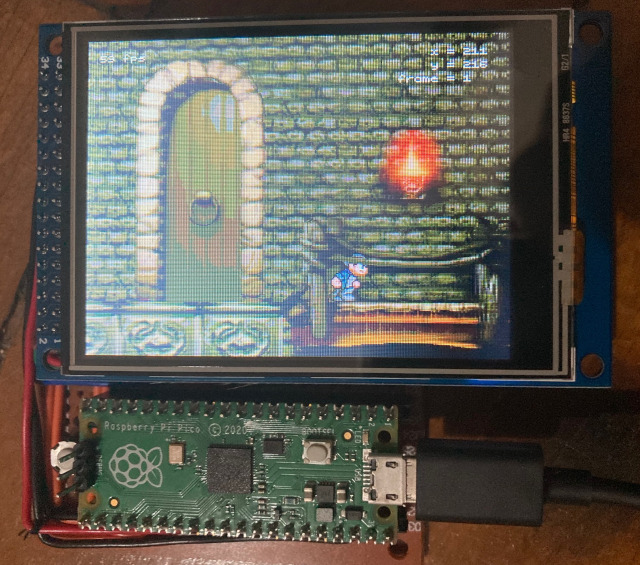
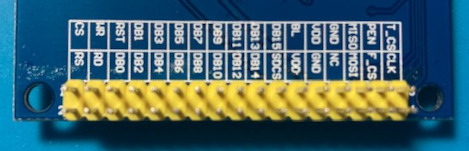
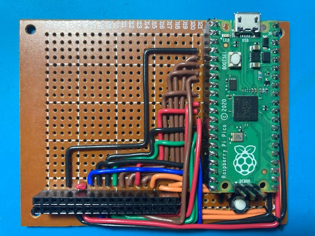

# pico-ili9341

This is a demo of the Raspberry Pi Pico sending data to an ILI9341 LCD controller at 60 frames per second using the parallel bit bus.

This demo uses 8 bits of color per pixel (even though the ILI9341 supports 16 or 18 bits) to save memory in the Pico, so we can have two framebuffers. This way we can send one framebuffer to the ILI9341 while we draw on the next one.

Initially the plan was to use PIO and DMA to send the data to make things fast -- that's why the pin connections between the Pico and the ILI9341 are all out of order (to make all the high order bits for all color components use sequential GPIO pins). It turns out that just bit-banging the data out is fast enough to achieve 60 frames per second (it's fast enough for about 130fps, and the bottleneck turned out to be copying the images from the flash to the framebuffer).

The pin connections are:

|  Pico GPIO | ILI9341 module pin | used for                           |
|-----------:|--------------------|------------------------------------|
|          2 | DB0                | command bit 0 / unused red bit 0   |
|          3 | DB1                | command bit 1 / unused red bit 1   |
|          4 | DB5                | command bit 5 / unused green bit 0 |
|          5 | DB6                | command bit 6 / unused green bit 1 |
|          6 | DB7                | command bit 7 / unused green bit 2 |
|          7 | DB2                | command bit 2 / red bit 2          |
|          8 | DB3                | command bit 3 / red bit 3          |
|          9 | DB4                | command bit 4 / red bit 4          |
|         10 | DB8                | green bit 3                        |
|         11 | DB9                | green bit 4                        |
|         12 | DB10               | green bit 5                        |
|         13 | DB14               | blue bit 3                         |
|         14 | DB15               | blue bit 4                         |
|         15 | RST                | reset                              |
|         16 | CS                 | chip select                        |
|         17 | RS                 | command/data select                |
|         18 | WR                 | write select                       |
|         19 | RD                 | read select                        |
|        GND | DB11               | unused blue bit 0                  |
|        GND | DB12               | unused blue bit 1                  |
|        GND | DB13               | unused blue bit 2                  |

The color bits marked "unused" are driven low when sending data, so only 8 color bits contain actual color data (3 red, 3 green and 2 blue).

